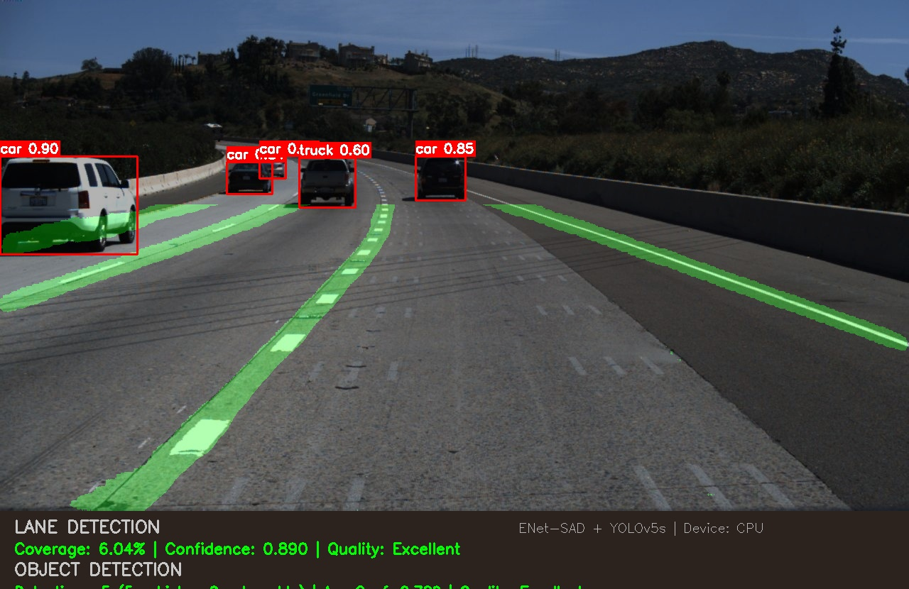

# Lane-And-Object-Detection
# 🚗 Lane and Object Detection on Images using ENet-SAD & YOLOv5

## 📌 Overview

This project implements a **hybrid deep learning system** for:

* **Lane Detection** using ENet-SAD
* **Object Detection** using YOLOv5

The model processes **input images** and produces annotated outputs with detected lanes and objects.

---

## 🎯 Features

* Lane detection on road images
* Object detection (vehicles, pedestrians, traffic lights)
* Hybrid model integration
* Works on single and multiple images

---

## 🧠 Technologies Used

* Python
* OpenCV
* PyTorch
* YOLOv5
* ENet-SAD

---

## 📂 Datasets Used

### 🚗 Lane Detection

* **TuSimple Dataset**

  * Designed for lane detection on highways
  * Provides labeled lane annotations
  * Used to train the ENet-SAD model

### 🚦 Object Detection

* **BDD100K Dataset**

  * Large-scale driving dataset
  * Contains objects like cars, pedestrians, traffic signals
  * Used for training and testing YOLOv5

---

## ⚙️ Workflow

1. Input Image
2. Lane Detection using ENet-SAD
3. Object Detection using YOLOv5
4. Merge outputs
5. Final annotated image

---

## 📁 Project Structure

```bash id="o4z5n3"
Lane-Object-Detection/
│
├── datasets/
│   ├── tusimple/
│   └── bdd100k/
├── input_images/
├── output_images/
├── main.py
└── requirements.txt
```

---

## 🚀 Installation

```bash id="8k3n1x"
git clone https://github.com/your-username/lane-object-detection.git
cd lane-object-detection
pip install -r requirements.txt
```

---

## ▶️ Usage

### Run on Image

```bash id="9b2kfd"
python main.py --source input_images/test.jpg
```

---

## 📊 Output

* Lane markings highlighted
* Objects detected with bounding boxes
* Output images saved in `output_images/`

---
## 📸 Screenshots

### 🔗 Combined Output


## 👩‍💻 Author

**Your Name**
GitHub: https://github.com/morapakulachandrika

---
